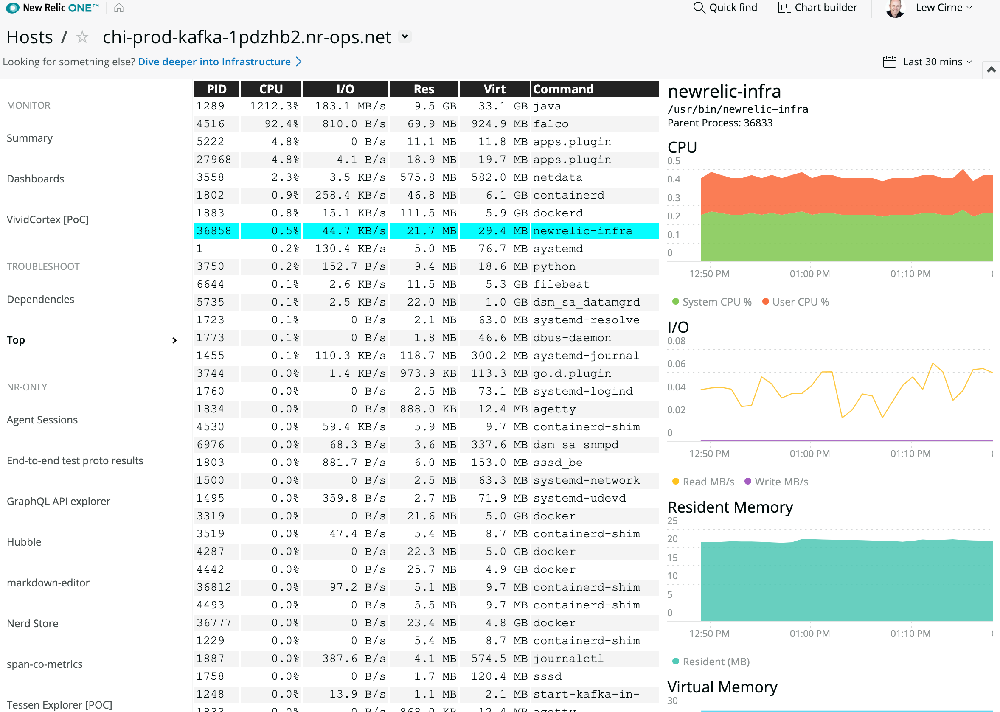

# nr1-top-nerdpack
A simple process monitor for New Relic One. 

## Usage
Requires New Relic Infrastructure agent to be delployed on a monitored host.

Select a host, and inspect the CPU, I/O and Memory of all processes running
on that host.

## Screenshot


## Open Source License

This project is distributed under the [Apache 2 license](./LICENSE).

## What do you need to make this work?

New Relic Infrastructure agent deployed on any host you want to monitor.

## Getting started

Clone this repository and run the following scripts:

```bash
git clone https://github.com/newrelic/nr1-top-nerdpack
cd nr1-top-nerdpack
npm install
npm start
```

Visit https://one.newrelic.com/?nerdpacks=local, Open the Entity Explorer, 
navigate to the a Host, and :sparkles:

# Support

New Relic has open-sourced this project. This project is provided AS-IS WITHOUT WARRANTY OR SUPPORT, although you can report issues and contribute to the project here on GitHub.

_Please do not report issues with this software to New Relic Global Technical Support._

## Community

New Relic hosts and moderates an online forum where customers can interact with New Relic employees as well as other customers to get help and share best practices. Like all official New Relic open source projects, there's a related Community topic in the New Relic Explorer's Hub. You can find this project's topic/threads here:

https://discuss.newrelic.com/c/build-on-new-relic/nr1-top-package
*(Note: URL subject to change before GA)*

## Issues / Enhancement Requests

Issues and enhancement requests can be submitted in the [Issues tab of this repository](issues). Please search for and review the existing open issues before submitting a new issue.

# Contributing

Contributions are welcome (and if you submit a Enhancement Request, expect to be invited to contribute it yourself :grin:). Please review our [Contributors Guide](./CONTRIBUTING.md).

Keep in mind that when you submit your pull request, you'll need to sign the CLA via the click-through using CLA-Assistant. If you'd like to execute our corporate CLA, or if you have any questions, please drop us an email at opensource@newrelic.com.